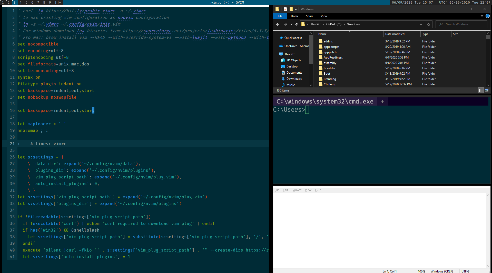

dwm-win32 is a port of the well known X11 window manager dwm to Microsoft
Windows.

It is recommended to run dwm-win32 as Administrator so it will catch all windows including those you ran as Administrator.



Description
===========

dwm is a dynamic window manager for Microsoft Windows. It manages windows
in tiled, monocle and floating layouts. Either layout can be applied
dynamically, optimising the environment for the application in use and
the task performed.

In tiled layouts windows are managed in a master and stacking area. The
master area contains the window which currently needs most attention,
whereas the stacking area contains all other windows. In monocle layout
all windows are maximised to the screen size. In floating layout windows
can be resized and moved freely. Dialog windows are always managed
floating, regardless of the layout applied.

Windows are grouped by tags. Each window can be tagged with one or
multiple tags. Selecting certain tags displays all windows with these
tags.

dwm contains a small status bar which displays all available tags, the 
layout and the title of the focused window. A floating window is indicated
with an empty square and a maximised floating window is indicated with a
filled square before the windows title. The selected tags are indicated
with a different color. The tags of the focused window are indicated with
a filled square in the top left corner.  The tags which are applied to
one or more windows are indicated with an empty square in the top left
corner.

dwm draws a small border around windows to indicate the focus state.

Usage
=====

 ## Keyboard

  dwm uses a modifier key by default this is `ALT`.


  `MOD + b`  Toggles bar on and off.

  `MOD + e` Toogles windows explorer and taskbar on and off.

  `MOD + t` Sets tiled layout.

  `MOD + f` Sets floating layout.

  `MOD + m` Sets monocle layout.

  `MOD + Control + space` Toggles between current and previous layout.

  `MOD + j` Focus next window.

  `MOD + k` Focus previous window.

  `MOD + h` Decrease master area size.

  `MOD + l` Increase master area size.

  `MOD + Control + Return` Zooms/cycles focused window to/from master area (tiled layouts only).

  `MOD + Shift + c` Close focused window.

  `MOD + Shift + Space` Toggle focused window between tiled and floating state.

  `MOD + n` Toggles border of currently focused window.

  `Mod + i` Display classname of currently focused window, useful for writing
     tagging rules.

  `MOD + Tab` Toggles to the previously selected tags.

  `MOD + Shift + [1..n]` Apply nth tag to focused window.

  `MOD + Shift + 0` Apply all tags to focused window.

  `MOD + Control + Shift + [1..n]` Add/remove nth tag to/from focused window.

  `MOD + Shift + j` Move stack +1

  `MOD + Shift + k` Move stack -1

  `MOD + [1..n]`  View all windows with nth tag.

  `MOD + 0` View all windows with any tag.

  `MOD + Control + [1..n]` Add/remove all windows with nth tag to/from the view.

  `MOD + Control + q`  Quit dwm.


 ## Mouse

  `Left Button` click on a tag label to display all windows with that tag, click
      on the layout label toggles between tiled and floating layout.

  `Right Button` click on a tag label adds/removes all windows with that tag to/from
      the view.

  `Alt + Left Button` click on a tag label applies that tag to the focused window.

  `Alt + Right Button` click on a tag label adds/removes that tag to/from the focused window.


How it works
============

A ShellHook is registered which is notified upon window creation and
destruction, however it is important to know that this only works for
unowned top level windows. This means we will not get notified when child
windows are created/destroyed. Therefore we scan the currently active top
level window upon activation to collect all associated child windows. 
This information is for example used to tag all windows and not just 
the toplevel one when tag changes occur.

This is all kind of messy and we might miss some child windows in certain
situations. A better approach would probably be to introduce a CBTProc 
function and register it with SetWindowsHookEx(WH_CBT, ...) with this we
would get notified by all and every windows including toolbars etc. 
which we would have to filter out.

Unfortunately the SetWindowsHookEx thingy seems to require a separate
dll because it will be loaded into each process address space.

COMPILING
=========

dwm-win32 requires `clang` and `make`. You can install the tools by using
[scoop](https://scoop.sh) as `scoop install make llvm`.

To compile dwm-win32 use the following command:

```cmd
make
```

To generate a pdb and disable optimizations use the following command to compile the debug version:

```cmd
make DEBUG=1
```

To compile a 32-bit version use the following command:

```cmd
make 32BIT=1
```

TODO
====

 - show/hide child windows upon tag switch, in theory this should already
   work but in practice we need to tweak ismanageable() so that it
   recognises child windows but doesn't generate false positives.
 - fullscreen windows, mstsc for example doesn't resize properly when
   maximized.
 - Screensaver?
 - system dialogs from desktop window
 - urgent flag?
 - window border isn't yet perfect
 - status text via stdin or a separate tool
 - crash handler which makes all windows visible restores borders etc
 - use BeginDeferWindowPos, DeferWindowPos and EndDeferWindowPos
 - optimize for speed
 - code cleanups all over the place
 - multi head support?

 [ - introduce a CBTProc function and register it with
     SetWindowsHookEx(WH_CBT, ...) to handle window events instead of the
     current mechanism in WndProc which is based on the shellhookid and 
     WH_SHELL because this only works for toplevel windows. See also the
     "How it works" section. ]
